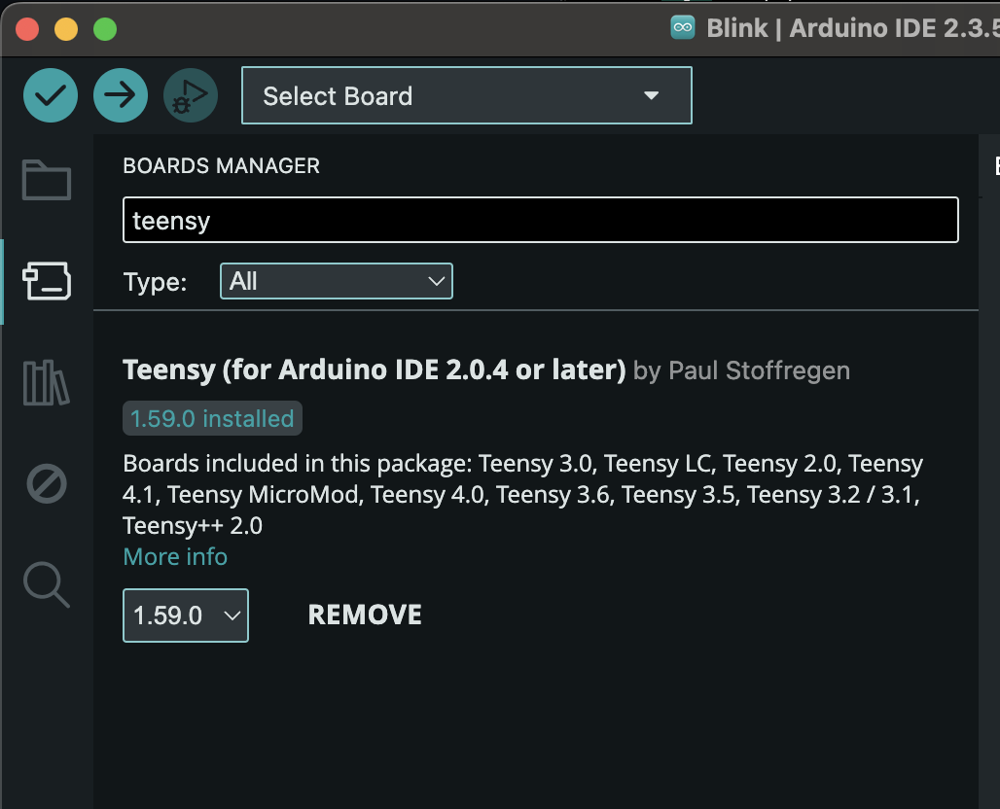

# Part X – [Title of This Part]

## Overview

In this part, we will explore the essential software tools required for the entire project.<br>
We will install the necessary development environments, configure them, and run an initial test to verify that the Teensy 4.0 board is working correctly and ready for further development.

---

## Objectives

- [ ] Install the required software tools (Arduino IDE, Teensyduino)
- [ ] Set up the Teensy 4.0 development environment
- [ ] Verify communication between the computer and the Teensy board
- [ ] Upload a basic test program (e.g., blinking LED) to the Teensy.

---

## Required Components

- Teensy 4.0  
- USB A to micro calbe  

---

## Installation Guide
In order to run the project we need to download the following softetware:
1. [Arduino IDE](https://www.arduino.cc/en/software) - Go to the link and download the IDE for your system.
2. Teensyduino - after downloading the the IDE press the BOARD MANAGER and search TEENSY and download TEENSY by Paul Stoffregen.<br>
   
4. [Teensy Loader](https://www.pjrc.com/teensy/loader.html) - by the time you see this Teensy Loader is included in the Teensyduino. Download only if you have an older version of Teensyduino downloaded.

---

## About The Teensy 4.0

The Teensy 4.0 is the core microcontroller used in this drone project. It’s a compact, high-performance board based on a 600 MHz ARM Cortex-M7 processor, designed for real-time and computation-heavy applications like flight control.

In this project, the Teensy 4.0 is responsible for:
-	Reading sensor data (e.g., gyroscope, barometer)
-	Interpreting RC receiver input using the PulsePosition library
-	Running PID control loops for flight stabilization (roll, pitch, yaw)
-	Generating PWM signals to control brushless motors via ESCs

Its speed and low latency are essential for stable, responsive drone behavior.

🔧 Key Features:
	-	600 MHz ARM Cortex-M7 32-bit CPU
	-	1 MB RAM, 2 MB Flash memory
	-	Supports PWM, UART, SPI, I2C, USB and more
	-	40 digital I/O pins
	-	Fast analog read, high-resolution timers
	-	Compatible with Arduino IDE (Teensyduino) and PlatformIO
	-	Compact size: only 1.4” x 0.7” (35.56 x 17.78 mm)

🔗 More Information

For a full technical overview, pinout diagrams, and library support, visit the official Teensy 4.0 page on PJRC’s website.

---

## Code Structure

### 🛠️ `setup()`
```cpp
void setup() {
  // Code here runs once when the board is powered on or reset
}
```
The setup block is called once when the microcontroller is powered on or reset.<br>
Used to configure the initial state of the system.<br>
Common tasks in setup():
-	Setting pin modes (pinMode())
-	Starting serial communication (Serial.begin())
-	Initializing sensors or libraries

```cpp
void loop() {
  // Code here runs repeatedly in an infinite loop
}
```
Runs in an infinite loop as long as the board is powered.<br>
Common tasks in loop():
- Read sensor values
-	Control outputs (LEDs, motors, etc.)
-	Respond to user inputs (buttons, receivers)
-	Perform repeated actions and logic

---

## Code Explanation

```ccp
void setup() {
  // put your setup code here, to run once:
  // Initialize port 13 as output
  pinMode(13, OUTPUT);
}

void loop() {
  // put your main code here, to run repeatedly:
  // Write pin 13 as high (on) and wait 500 ms.
  digitalWrite(13,HIGH);
  delay(500);
  
  // Write pin 13 as low (off) and wait 500 ms.
  digitalWrite(13,LOW);
  delay(500);
}
```
look for function explenation file to see the function used in the project and what is there purpose.

## Testing & Results

- What to expect when you run the code  
- How to verify it works  
- Common issues and how to troubleshoot  

---

## Media (Optional)

You can include:
- Images
- GIFs
- Short videos (hosted externally like YouTube or in `Media/` folder)

---

## Next Step

Mention the next part or what builds upon this one:  
👉 [Continue to Part X – Title](../Part%20X%20-%20Title)
